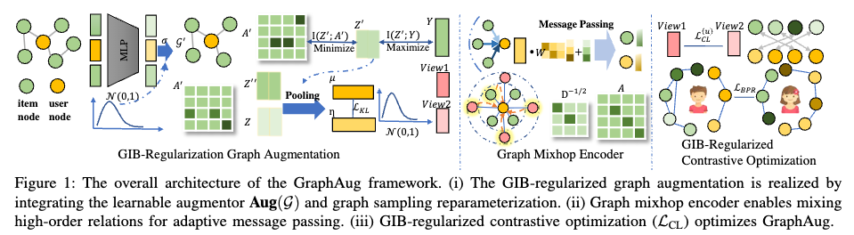
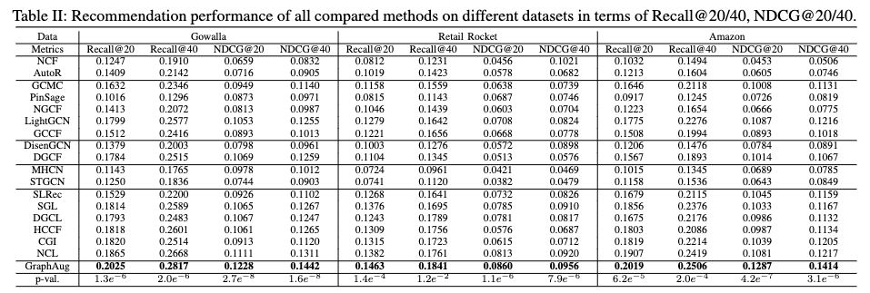

# GraphAug: Graph Augmentation for Recommendation (ICDE'2024) #
This is the implementation of Graph Augmentation for Recommendation:

## Exoeriments ##
Pytorch = 1.12.1, python = 3.9.13

## Data ##
Gowalla data, Retail Rocket data and Amazon.
The for Retail Roacket data and Amazon data are https://www.kaggle.com/datasets/retailrocket/ecommerce-dataset and https://jmcauley.ucsd.edu/data/amazon. Users and items with too few interactions are filtered. The datasets are divided into training set, validation set and testing set by 7:1:2. All the datasets are process and stored in pickle format. 
## Hyperparameters ##
The hidden dimensionality is  set as 32 to achieve their best performance as reported results. The learning rate is initialized as 0.001 with weight decay 0.96. The number of message passing iterations is selected from [1,2,3]. The slope of LeakyRelu is 0.5. The temperature parameter is set as 0.9 of contrastive  learning when the model achieves the best results. The threshold for filtering edges is chosen from [0.0, 0.2, 0.4, 0.6, 0.8]  and the model achieves the best performance when threshold is set as 0.2. The weight for loss for optimizing information bottleneck is 0.00001, which is searched from the range [0.000001, 0.00001, 0.0001, 0.001]. The weight for contrastive learning loss and regularization term is set as 1.0. The weight decay  is 0.0000007. 

## How to Run the Code
    python Main.py --data gowalla   
    python Main.py --data retail_rocket
    python Main.py --data kindle
Firstly you need to unzip data. Then you need to create ../History directory and ../Models directory. Then you can run the code following the order.

## Citing ##
If our paper benefits to your research, please cite our paper using the bitex below:

    @article{zhang2024graph,
      title={Graph Augmentation for Recommendation},
      author={Zhang, Qianru and Xia, Lianghao and Cai, Xuheng and Yiu, Siuming and Huang, Chao and Jensen, Christian S},
      journal={arXiv preprint arXiv:2403.16656},
      year={2024}
     }
